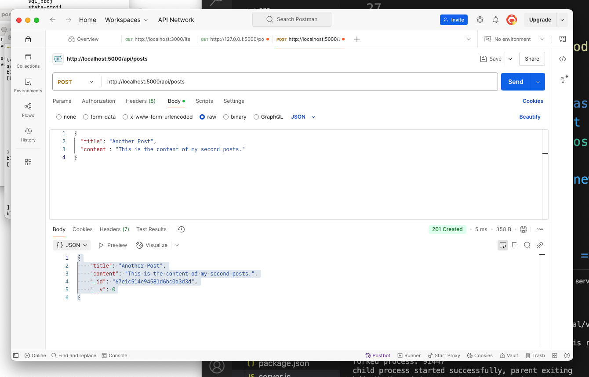
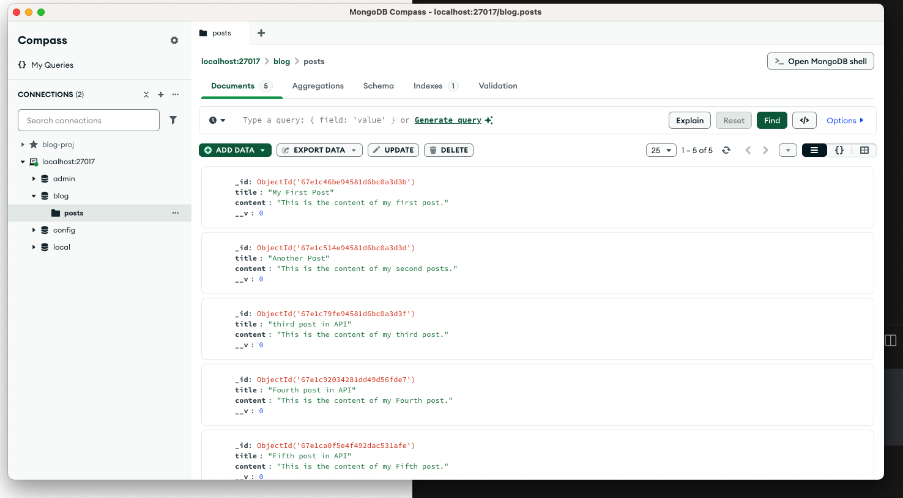
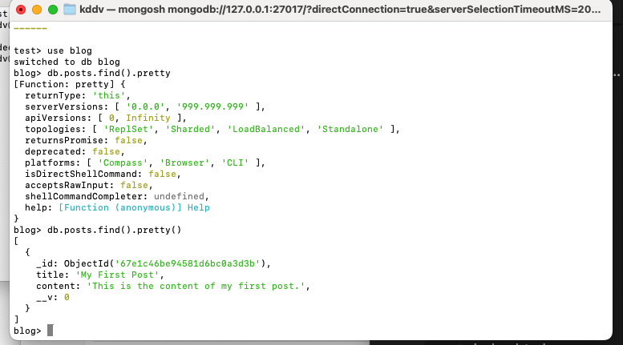

# 🚀 Dynamic Post System with NodeJS No-SQL MongoDB MERN STACK

[](https://your-demo-link.com)
[](LICENSE)
[](https://mern.io)

A full-featured social posting platform with real-time interactions, built with the MERN stack (MongoDB, Express, React, Node.js) and WebSockets.


## Screenshots




## ✨ Key Features

- **Real-time post updates** using Socket.IO
- **JWT authentication** with secure route protection
- **Rich post interactions** (likes, comments, shares)
- **Optimized performance** with React memoization
- **Responsive design** works on all devices

## 🛠 Tech Stack

### Frontend
| Technology | Use Case |
|------------|----------|
| React 18 | Component-based UI |
| Redux Toolkit | State management |
| Socket.IO Client | Real-time updates |
| TailwindCSS | Responsive styling |

### Backend
| Technology | Use Case |
|------------|----------|
| Node.js 20 | Runtime environment |
| Express.js | REST API framework |
| Mongoose | MongoDB ORM |
| Socket.IO | WebSocket implementation |

### Infrastructure
| Technology | Use Case |
|------------|----------|
| MongoDB Atlas | Cloud database |
| Docker | Containerization |
| GitHub Actions | CI/CD pipelines |

## 🏗 Project Structure
dynamic-post-system/
├── client/ # React frontend
│ ├── public/ # Static assets
│ └── src/
│ ├── components/ # Reusable UI
│ ├── features/ # Redux slices
│ ├── hooks/ # Custom hooks
│ └── lib/ # API clients
│
├── server/ # Node backend
│ ├── config/ # DB connection
│ ├── controllers/ # Route handlers
│ ├── middleware/ # Auth checks
│ ├── models/ # Mongoose schemas
│ ├── routes/ # API endpoints
│ └── sockets/ # Real-time handlers
│
├── .github/ # CI/CD workflows
├── docs/ # Documentation
└── docker-compose.yml # Container setup


## 🚀 Getting Started

### Prerequisites
- Node.js v18+
- MongoDB Atlas account
- Docker (optional)

### Installation
```bash
# Clone the repository
git clone https://github.com/yourusername/dynamic-posts.git

# Install dependencies
cd dynamic-posts/server && npm install
cd ../client && npm install

# Set up environment variables
cp .env.example .env

# Run backend tests
cd server && npm test

# Run frontend tests
cd client && npm test